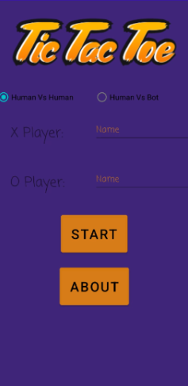
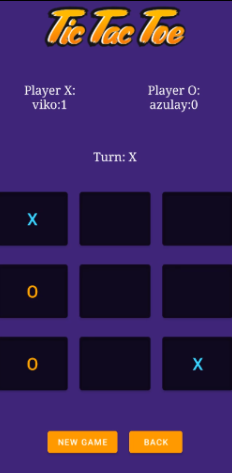
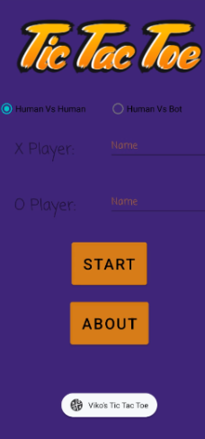
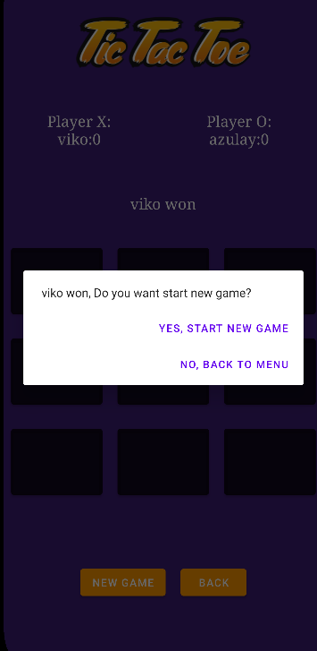

# 🎯 Tic Tac Toe

A modern and fun **Tic Tac Toe** game built for Android 📱.  
Play **Player vs Player** or challenge the **built-in bot** 🤖 for a quick match.  
Simple, elegant, and ready to bring back the classic game nostalgia with a smooth design and easy controls.

---

## 🎮 Play Now

- **📥 Download APK**: [Click here](https://github.com/vikoaz/TicTacToe/releases/download/v1.0.0/app-debug.apk)  
- **🌐 Play Online**: [Launch Demo](https://appetize.io/app/b_enfmq5kpcglxn545yskzkshhs4) *(No install required)*

---

## 📸 Screenshots

| Main Menu | Gameplay 1 | Gameplay 2 |
|-----------|------------|------------|
|  |  |  |

| About Screen | Winner Dialog |
|--------------|---------------|
|  |  |

---

## ✨ Features

- 🎯 **Two Game Modes** – Player vs Player & Player vs Bot.  
- 🤖 **Smart AI** – The bot makes challenging moves.  
- 🎨 **Clean UI** – Smooth and minimalistic interface.  
- 📱 **Mobile-Ready** – Designed for Android devices.  
- ⚡ **Instant Play** – Try online without installing.

---

## 🛠 Tech Stack

- **Java** ☕  
- **Android SDK** 📱  
- **XML Layouts** 🎨

---

## 📌 How to Install

1. **Download the APK** from the link above.  
2. On your Android device, enable *"Install from Unknown Sources"* in Settings (if needed).  
3. Open the APK and install.  
4. Launch and enjoy! 🎉

---

## 👨‍💻 Author

**Viko Azulay**  
💼 GitHub: [vikoaz](https://github.com/vikoaz)  

---
